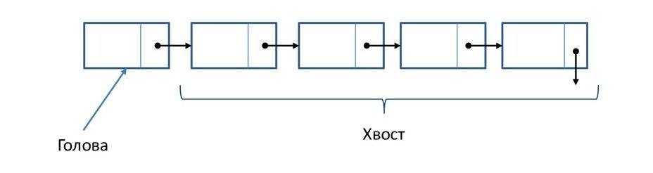
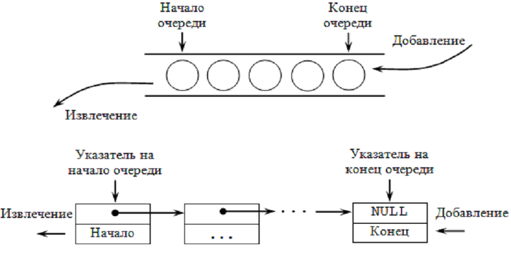

# Структуры данных и алгоритмы.

## Линейные алгоритмы

### Задача 1: Подсчет количества повторений слов
    Дано:
    А В АА ВВ А ВВ А
    
    Результат:
    А - 3
    В - 1
    АА - 1
    ВВ - 2

### Задача 2: Удаление дубликатов
    Дано:
    А В А АА В ВВ А ВВ
    
    Результат:
    А В АА ВВ

### Задача 3: Поиск популярных слов
Из списка слов надо найти 10 наиболее часто встречаемых, длинной больше 5

### Задача 4: Подсчет количества повторений букв
Найти сколько раз встречается символ в строке

### Задача 5: Найти 3 максимума
В списке чисел найти 3 максимальных

### Задача 5: Найти 2 минимума и количество повторений
Найти 2 минимальных числа в списке, и указать кол-во сколько он встречается.

## Списки

### Односвязанный список
Односвязанный список — динамическая структура данных, состоящая из узлов, каждый из которых содержит данные и одну ссылку на следующий или предыдущий узел

### Очередь
Очередь - тип данный с доступом к элементам: первый пришёл — первый вышел (FIFO)
Добавление элемента (enqueue) возможно лишь в конец очереди, выборка — только из начала очереди (dequeue), при этом выбранный элемент из очереди удаляется.

Очередь представляется в качестве линейного списка, в котором добавление/удаление элементов идет строго с соответствующих его концов.
Преимущества данного метода: размер очереди ограничен лишь объёмом памяти.
Недостатки: сложнее в разработке; требуется больше памяти; при работе с такой очередью память сильнее фрагментируется; работа с очередью несколько медленнее.

### Стек
Стек - тип данный с доступом к элементам: последним пришёл — первым вышел (LIFO)

Возможны три операции со стеком: 
- добавление элемента (push),
- удаление элемента (pop)
- чтение головного элемента (peek).

При проталкивании (push) добавляется новый элемент, указывающий на элемент, бывший до этого головой. Новый элемент теперь становится головным.

При удалении элемента (pop) убирается первый, а головным становится тот, на который был указатель у этого объекта (следующий элемент). При этом значение убранного элемента возвращается. 